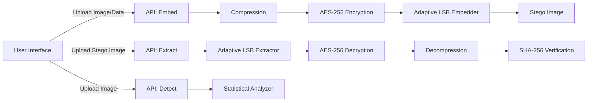

Download zip or clone the project from :
https://github.com/Drushyagowda17/stegnography.git


# Advanced Image Steganography System

## Project Overview
This project implements a full-stack, secure image steganography and steganalysis system. It hides confidential data inside images with minimal perceptual distortion, supports AES-256 encryption and compression for improved payload capacity, and provides detection analytics for forensic inspection.

## Problem Statement
Digital communication often requires covert data transmission without visible artifacts. A robust solution must both conceal information and help analysts detect hidden data in suspicious media. This system delivers both secure embedding and intelligent detection in a single production-ready interface.

## Features
- Adaptive LSB embedding across RGB channels with edge-aware depth selection
- AES-256-GCM encryption with PBKDF2 key derivation
- Compression before encryption to maximize payload capacity
- Extraction with SHA-256 integrity verification
- Steganalysis based on LSB statistics, entropy, and correlation
- PSNR, MSE, and capacity metrics with visual comparison
- Professional UI with previews, status feedback, and downloads


# How To Run

## Prerequisites
- Python 3.10 or newer
- pip

## Installation
```bash
python -m venv .venv
source .venv/bin/activate  # Windows: .venv\\Scripts\\activate
pip install -r requirements.txt
```

## Run Backend and Frontend
```bash
uvicorn main:app --reload
```

Open the app at `http://127.0.0.1:8000`.

## Usage
### Embed
1. Upload a cover image.
2. Provide secret text or a secret file.
3. Enter an encryption key.
4. Generate and download the stego image.

### Extract
1. Upload the stego image.
2. Enter the correct key.
3. Download the extracted file and verify integrity.

### Detect
1. Upload any image.
2. Review the probability score and verdict.

## Sample Inputs and Outputs
- Input: `cover.png` + `secret.txt` with a strong key.
- Output: `stego.png` with PSNR and MSE shown in the UI.

## Common Errors and Fixes
- Error: "OpenCV is required for adaptive embedding."
  Fix: Ensure `opencv-python` is installed from `requirements.txt`.
- Error: "Payload too large for this image."
  Fix: Use a higher resolution image or reduce secret data size.
- Error: "No hidden data found or wrong key."
  Fix: Verify the correct image and key are used.


## Architecture Diagram


## Algorithms Used
- Adaptive LSB embedding with edge-based depth selection (1-2 bits per channel)
- Redundant bit repetition with majority voting for resilience to minor noise
- AES-256-GCM encryption with PBKDF2-HMAC-SHA256 key derivation
- SHA-256 hashing for integrity checks
- Zlib compression before encryption
- Steganalysis: LSB entropy, chi-square uniformity, and correlation analysis
- Quality metrics: MSE and PSNR

## Security Considerations
- AES-256-GCM provides confidentiality and tamper detection
- PBKDF2 hardens passphrases using salt and high iteration counts
- SHA-256 verifies data integrity after extraction
- Key-derived pixel shuffling reduces predictable LSB artifacts
- Detection module provides a probabilistic verdict rather than a guarantee

## Performance Metrics Explanation
- MSE measures pixel-level distortion between original and stego images
- PSNR provides a perceptual quality score derived from MSE
- Payload capacity reflects the maximum embeddable bytes for a given image

## Real-World Applications
- Secure communication
- Digital watermarking
- Intellectual property protection
- Cyber forensics
- Covert data transmission

## One-Line Summary
A full-stack, secure image steganography and steganalysis system combining adaptive LSB techniques, AES-256 encryption, and a professional-grade interface with complete documentation.
